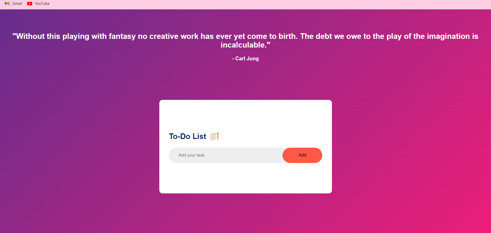

# To-Do List



## Introduction
A simple web-based to-do list application to help you keep track of tasks and stay organized.

## Features
- Add task 
- Mark tasks as completed
- Delete task after complete it
- Display random quote on a screen after every 30 second

## Getting started
By clicking on the link given below you are able to run the To-Do List Project on your local machine.

[To-Do List](https://karanrainavaar.github.io/To-Do-List/)

### what I learned New ?
+ CSS
  - Linear-gradient
    ```CSS 
    background: linear-gradient(135deg,#662D8C ,#ED1E79);
    ```
  - Box-sizing
    ```CSS
    box-sizing: border-box;
    ```

+ Local Storage
  - setItem
    ```javascript
    localStorage.setItem("data",ul.innerHTML);
    ```
  - getItem
    ```javascript
    ul.innerHTML = localStorage.getItem("data");
    ```
    
+ How to call APIs
> I used this API [QuoteAPI](https://api.quotable.io/quotes/random) to display random quote on a screen.
